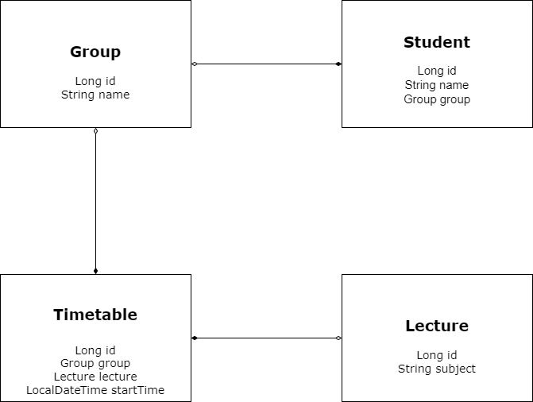

## Installation
1. Fork and copy this project
2. Run "./mvnw clean package" command
3. Run docker and run following command "docker-compose up -d"  
## Usage
Test data will be created by DataInitializer class at the start of program. There is following data:
```
1. Students with id: 1, 2, 3  
2. Date when students have lectures: 11.12.2021, 10.12.2021  
```
To get Timetable for student you can use for example following endpoint:  
/timetables?studentId=1&date=10.12.2021  
Also there are endpoints for all CRUD operations:  
1. POST /groups, body example: {"name" : "groupName"}  
2. POST /lectures : {"subject" : "subjectName"}
3. POST /students : {"name" : "studentName", "groupId" : 1}
4. POST /timetables : {"startTime" : "12.12.2021 12:00", "groupId" : 1, "lectureId"}
5. GET /groups/{id}, GET /lectures/{id}, GET /students/{id}, GET /timetables/{id}
6. PUT /groups/{id}, GET /lectures/{id}, GET /students/{id}, GET /timetables/{id} (body like in POST)
7. DELETE /groups/{id}, GET /lectures/{id}, GET /students/{id}, GET /timetables/{id}

Models relation diagram:  


